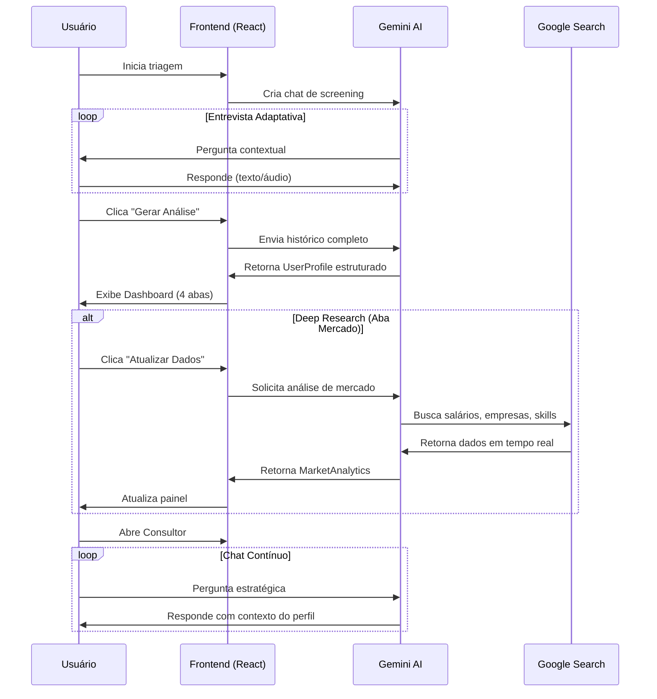

<div align="center">
  
  
  # 🚀 AI Career Architect
  
  ### Sua Carreira Potencializada por IA
  
  [](https://ai.google.dev/)
  [](https://react.dev/)
  [](https://www.typescriptlang.org/)
  [](https://vitejs.dev/)
  
  **[Documentação](#-índice)** • **[Contribuir](#-equipe)**
  
</div>

---

## 📖 Sobre o Projeto

**AI Career Architect** é uma plataforma revolucionária de consultoria de carreira, alimentada pelo **Google Gemini 3.0 Preview** - o modelo de linguagem mais avançado do Google. O sistema realiza análise profunda do perfil profissional do usuário através de uma entrevista inteligente, gerando insights acionáveis, identificando lacunas de competências e criando um plano estratégico completo de desenvolvimento de carreira.

### 🎯 O Problema que Resolvemos

Milhares de profissionais brasileiros enfrentam dificuldades para:
- ❌ Identificar lacunas críticas em suas competências
- ❌ Compreender seu real posicionamento no mercado
- ❌ Criar currículos otimizados para sistemas ATS
- ❌ Traçar estratégias claras de desenvolvimento profissional
- ❌ Entender tendências salariais e demanda real do mercado

### ✨ Nossa Solução: Sistema de 3 Etapas

Um agente de IA que transforma conversas em estratégias completas de carreira:

#### **Etapa 1: Triagem Inteligente** 🎤
Entrevista estruturada em linguagem natural, adaptativa e empática. A IA conduz uma conversa humanizada (não robotizada) para mapear:
- Formação acadêmica e certificações
- Histórico profissional completo
- Hard skills (ferramentas, tecnologias, frameworks)
- Soft skills (liderança, comunicação, resiliência)
- Objetivos de carreira (curto, médio e longo prazo)
- Preferências de trabalho (remoto/híbrido/presencial)
- Suporte a **texto e áudio** (transcrição em tempo real)

#### **Etapa 2: Análise Profunda com 4 Painéis** 📊

##### **Painel 1: Estratégia**
- Resumo do momento atual de carreira
- 3-5 caminhos profissionais sugeridos com **match score**
- Roadmap visual (curto e médio prazo)
- Análise de riscos e próximos passos práticos

##### **Painel 2: Skills & PDI (Plano de Desenvolvimento Individual)**
- Mapeamento de fortalezas (hard e soft skills)
- Identificação de gaps críticos com priorização
- **PDI estruturado** com objetivos, prazos e ações
- 🎧 **Text-to-Speech**: Ouça seu plano narrado pela IA

##### **Painel 3: Mercado (Deep Research com Google Search)**
- 🔍 **Pesquisa em tempo real** usando Google Search Integration
- Faixas salariais detalhadas (Júnior/Pleno/Sênior) no Brasil
- Top empresas contratando na área
- Skills em alta demanda (com indicador se você possui)
- Projeção de crescimento de vagas (5 anos)
- Insights sobre ROI de certificações

##### **Painel 4: Currículo Otimizado ATS**
- Currículo adaptado ao nível de senioridade
- Metodologia STAR nos bullets de experiência
- Keywords estratégicas para rastreamento ATS
- Exportação para **PDF** (via impressão) e **Word (.doc)**
- Templates profissionais diferenciados

#### **Etapa 3: Consultor Virtual 24/7** 💬
Chat contínuo com acesso a todo o contexto do usuário:
- Orientação sobre PDI e metas trimestrais
- Preparação para entrevistas técnicas e comportamentais
- Sugestões personalizadas de cursos e certificações
- Estratégias de negociação salarial
- Análise de novas oportunidades de carreira

---

## 🌟 Diferenciais Técnicos

### **1. Transcrição de Áudio em Tempo Real**
```typescript
// Captura nativa do navegador via MediaRecorder API
const stream = await navigator.mediaDevices.getUserMedia({ audio: true });
const mediaRecorder = new MediaRecorder(stream);

// Transcrição via Gemini 2.5 Flash
const text = await transcribeUserAudio(apiKey, base64Audio, mimeType);
```

### **2. Text-to-Speech Nativo (Gemini TTS)**
```typescript
// Narração do PDI com voz natural brasileira
const base64Audio = await generateTextToSpeech(apiKey, pdiText);

// Decodificação PCM raw e reprodução via Web Audio API
const audioBuffer = await decodeAudioData(decode(base64Audio), ctx, 24000, 1);
```

### **3. Google Search Integration**
```typescript
// Deep Research com busca web em tempo real
const response = await ai.models.generateContent({
  model: 'gemini-3-pro-preview',
  contents: prompt,
  config: {
    tools: [{ googleSearch: {} }],  // 🔍 Ativa Google Search
  }
});
```

### **4. Schema Validation Rigoroso**
```typescript
// Força estrutura JSON consistente (elimina respostas chatty)
const response = await ai.models.generateContent({
  config: {
    responseMimeType: 'application/json',
    responseSchema: profileSchema,  // TypeScript → Gemini
  }
});
```

---

## 🛠️ Tecnologias Utilizadas

### **Stack Principal**
| Tecnologia | Versão | Uso |
|------------|--------|-----|
| **React** | 19.2.3 | UI Framework com Hooks modernos |
| **TypeScript** | 5.8.2 | Type Safety e IntelliSense |
| **Vite** | 6.2.0 | Build Tool ultra-rápido (ESM nativo) |
| **Tailwind CSS** | 3.x | Estilização via CDN (Utility-First) |
| **Google GenAI SDK** | 1.33.0 | Integração oficial com Gemini |

### **IA & APIs**
- **Google Gemini 3.0 Pro Preview**: Modelo principal (raciocínio avançado)
- **Gemini 2.5 Flash**: Transcrição de áudio rápida
- **Gemini TTS (Preview)**: Text-to-Speech com voz natural
- **Google Search API**: Pesquisa de mercado em tempo real

### **Arquitetura de Pastas**
```
├── components/          # Componentes React
│   ├── ChatWindow.tsx   # Interface de chat (texto + áudio)
│   ├── Dashboard.tsx    # Dashboard principal (4 abas + tabs)
│   └── PersonalDetailsForm.tsx  # Formulário de dados iniciais
├── services/            # Lógica de integração
│   └── geminiService.ts # API do Gemini (chat, transcrição, TTS, search)
├── types.ts             # Definições TypeScript (UserProfile, MarketAnalytics)
├── constants.ts         # System prompts (Screening + Consultant)
├── App.tsx              # Orquestração principal (state + routing)
├── index.tsx            # Entry point React
└── vite.config.ts       # Configuração do Vite
```

---

## 🚀 Começando

### **Pré-requisitos**
- Node.js 16+ (ou 18+ recomendado)
- Chave de API do Google Gemini ([obter aqui](https://aistudio.google.com/app/apikey))
- Navegador moderno (Chrome, Firefox, Edge)

### **Instalação Rápida**

1. **Clone o repositório**
```bash
git clone https://github.com/Kaykbr/hackatonjouletest.git
cd hackatonjouletest
```

2. **Instale as dependências**
```bash
npm install
```

3. **Configure a API Key**

Crie/edite o arquivo `.env.local` na raiz do projeto:
```env
GEMINI_API_KEY=AIza...sua_chave_aqui
VITE_GEMINI_API_KEY=AIza...sua_chave_aqui
```

> **Nota**: `VITE_GEMINI_API_KEY` expõe a chave ao frontend (convenção do Vite). Use apenas em ambientes de desenvolvimento local.

4. **Inicie o servidor de desenvolvimento**
```bash
npm run dev
```

Acesse: **http://localhost:3000**

### **Build para Produção**
```bash
npm run build    # Gera pasta dist/
npm run preview  # Previsualiza build
```

---

## 📊 Fluxo do Sistema



---

## 🎨 Prompt Engineering

O sistema usa **2 prompts especializados**:

### **1. SCREENING_SYSTEM_PROMPT**
Persona: *Headhunter Sênior Empático*
- Conduz entrevista natural (não robotizada)
- Investiga profundidade quando necessário
- Adapta perguntas baseado em respostas anteriores
- Encerra com instrução clara de "Gerar Análise"

### **2. CONSULTANT_SYSTEM_PROMPT**
Persona: *Consultor de Carreira Executivo*
- Acesso ao perfil completo do usuário
- Respostas técnicas e estratégicas
- Focado no mercado brasileiro (Glassdoor, Robert Half)
- Usa formatação Markdown para clareza

---

## 👥 Equipe

<table>
  <tr>
    <td align="center">
      <a href="https://github.com/Kaykbr">
        <br>
        <sub><b>Kayky Bezerra</b></sub>
      </a>
    </td>
    <td align="center">
      <br>
      <sub><b>Beatriz</b></sub>
    </td>
    <td align="center">
      <a href="https://github.com/MaduAraujo">
        <br>
        <sub><b>Maria Eduarda</b></sub>
      </a>
    </td>
  </tr>
</table>

---

## 📚 Índice

- [Sobre o Projeto](#-sobre-o-projeto)
- [Tecnologias](#-tecnologias-utilizadas)
- [Instalação](#-começando)
- [Fluxo do Sistema](#-fluxo-do-sistema)
- [Equipe](#-equipe)
- [Contribuindo](#-contribuindo)
- [Licença](#-licença)

---

## 🤝 Contribuindo

Contribuições são bem-vindas! Veja como:

1. Fork o projeto
2. Crie uma branch (`git checkout -b feature/MinhaFeature`)
3. Commit suas mudanças (`git commit -m 'Add: Nova Feature'`)
4. Push para a branch (`git push origin feature/MinhaFeature`)
5. Abra um Pull Request

### **Convenções de Commit**
```
feat: Nova funcionalidade
fix: Correção de bug
docs: Alteração em documentação
style: Formatação de código
refactor: Refatoração sem mudança de funcionalidade
test: Adição de testes
```

---

## 📄 Licença

Este projeto foi desenvolvido para o **Hackathon Joule 2025**.

---

## 🎓 Aprendizados e Desafios Técnicos

### **Desafios Superados**
1. ✅ Implementação de áudio bidirecional (gravação + narração TTS)
2. ✅ Decodificação de PCM raw (16-bit) para Web Audio API
3. ✅ Orquestração de múltiplos modelos Gemini simultâneos
4. ✅ Sanitização robusta de JSON (prevenção de null/undefined)
5. ✅ Exportação de currículo para Word mantendo formatação

### **Próximos Passos**
- [ ] Autenticação de usuários (Firebase/Supabase)
- [ ] Persistência de perfis e versionamento de currículos
- [ ] Integração com LinkedIn para importação de dados
- [ ] Sistema de templates de currículo customizáveis
- [ ] Modo offline com cache de análises (IndexedDB)
- [ ] Testes automatizados (Vitest + React Testing Library)

---

## 📞 Suporte

- 🐛 **Issues**: [GitHub Issues](https://github.com/Kaykbr/hackatonjouletest/issues)
- 📧 **Email**: kaykybritosilva23@gmail.com

---

<div align="center">
  
  ### ⭐ Se este projeto te ajudou, deixe uma estrela!
  
  **Feito com ❤️ por Kayky Bezerra, Beatriz e Maria Eduarda**
  
  [⬆ Voltar ao topo](#-ai-career-architect)
  
</div>
